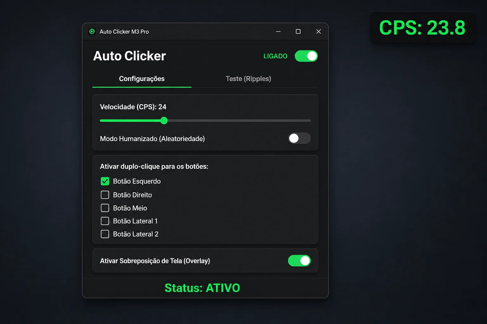

# Auto Clicker M3 Pro

Auto-clicker para Windows com interface escura estilo Material Design 3.



## Como funciona

1. Faça um **duplo-clique** em um botão do mouse habilitado
2. **Mantenha pressionado** — o app injeta cliques na taxa configurada (CPS)
3. **Solte** o botão para parar

Não usa atalhos de teclado nem coordenadas fixas: o gatilho é o próprio botão do mouse.

## Recursos

- Velocidade de **1 a 100 CPS**
- **Modo humanizado** (intervalos aleatórios)
- Gatilhos: esquerdo, direito, meio, X1 e X2
- **Overlay** com CPS real em tempo real
- Aba de teste com efeito de ripples

## Estrutura

```
AutoClicker/
├── run.bat / run.sh   # atalho → versão C++
├── cpp/               # versão primária (Win32)
├── python/            # versão secundária (CustomTkinter + pynput)
├── installer/         # scripts Inno Setup (setup.exe Windows)
├── docs/screenshots/  # imagens do README
└── assets/
```

## Executar

Na raiz (C++ por padrão, Windows):

```powershell
.\run.bat          # Windows
./run.sh           # Windows (MinGW/MSYS); Linux/macOS: use Python
```

Direto em cada versão:

```powershell
.\cpp\run.bat      # Windows; compila se o .exe nao existir
.\python\run.bat
```

```bash
./cpp/run.sh       # so em ambiente Windows (MinGW/MSYS)
./python/run.sh    # Linux / macOS / Windows
```

## C++ (primária)

Win32, sem dependências externas — mesmo modelo de duplo-clique + hold.

```powershell
cmake -S cpp -B cpp/build -G "MinGW Makefiles"
cmake --build cpp/build
.\cpp\build\bin\AutoClickerM3Cpp.exe
```

Releases prontas na [página de Releases](https://github.com/GuilhermeRoesler/AutoClicker/releases):

| Arquivo | Tipo |
|---------|------|
| `AutoClickerM3-windows-optimized-setup.exe` | Instalador C++ (recomendado) |
| `AutoClickerM3-windows-optimized-portable.exe` | Portátil C++ |
| `AutoClickerM3-windows-setup.exe` | Instalador Python |
| `AutoClickerM3-windows-portable.exe` | Portátil Python |

O instalador (Inno Setup) cria atalhos e entrada de desinstalação; o portátil é só o `.exe`.

## Python (secundária)

Requisitos: Windows · Python 3.12+

```powershell
git clone https://github.com/GuilhermeRoesler/AutoClicker.git
cd AutoClicker/python
python -m venv venv
.\venv\Scripts\Activate.ps1
pip install -r requirements.txt
python main.py
```

### Build do executável

```powershell
cd python
python build.py
```

O arquivo sai em `python/dist/AutoClickerM3.exe` (base do portátil / instalador Windows).

### Instalador Windows (Inno Setup)

Com [Inno Setup 6](https://jrsoftware.org/isinfo.php) instalado e o `.exe` já gerado:

```powershell
mkdir dist\staging-python -Force
copy python\dist\AutoClickerM3.exe dist\staging-python\AutoClickerM3.exe
& "${env:ProgramFiles(x86)}\Inno Setup 6\ISCC.exe" installer\python.iss /DMyAppVersion=1.0.0
```

Para o C++, use `dist\staging-cpp\AutoClickerM3.exe` e `installer\cpp.iss`. Detalhes em `installer/README.md`.

## Stack

- **Primária:** C++17 · Win32 + GDI+ · CMake
- **Secundária:** Python · CustomTkinter · pynput · PyInstaller

## Licença

Uso pessoal. Consulte o repositório para detalhes de distribuição.
